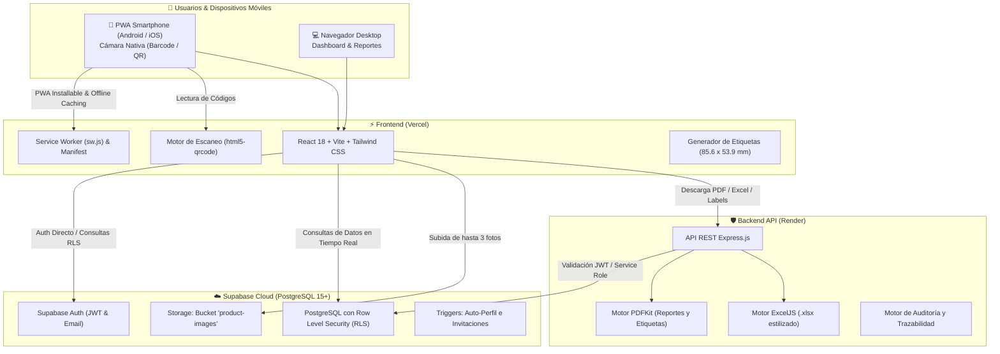

# 📦 Plataforma de Gestión de Inventarios Colaborativa y Personalizable (PWA)

Sistema empresarial de control de inventarios, trazabilidad de movimientos, generación de etiquetas QR en dimensiones de tarjeta de crédito (85.6 mm × 53.9 mm), escaneo móvil por cámara y reportería ejecutiva (PDF / Excel / CSV).

Diseñado con arquitectura desacoplada para despliegue serverless y cloud en:
- **Base de Datos, Auth & Storage:** [Supabase](https://supabase.com) (PostgreSQL + RLS estricto + Auth + Storage).
- **Backend API & Generación Pesada:** [Render](https://render.com) (Node.js/Express + PDFKit + ExcelJS).
- **Frontend PWA Mobile-First:** [Vercel](https://vercel.com) (React + TypeScript + Tailwind CSS + `html5-qrcode`).
- **Control de Versiones & CI/CD:** [GitHub](https://github.com) (GitHub Actions automatizado).

---

## 🏗️ 1. Arquitectura Técnica del Sistema



---

## 📁 2. Estructura del Repositorio

```text
PlataformaPagos/
├── .github/
│   └── workflows/
│       └── ci.yml                     # Pipeline CI/CD automatizado
├── database/
│   ├── schema.sql                     # Esquema PostgreSQL completo con RLS y Storage
│   └── seed.sql                       # Datos iniciales demostrativos
├── backend/
│   ├── src/
│   │   ├── config/
│   │   │   └── supabase.js            # Cliente Supabase Admin y Scoped
│   │   ├── middlewares/
│   │   │   └── auth.js                # Validación de tokens JWT
│   │   ├── routes/
│   │   │   ├── reports.js             # Endpoints PDF, Excel (.xlsx) y CSV
│   │   │   ├── labels.js              # Endpoint de Etiquetas (85.6 x 53.9 mm)
│   │   │   ├── audit.js               # Consulta y registro de trazabilidad
│   │   │   └── collaborators.js       # Invitación y gestión de equipo
│   │   └── services/
│   │       ├── pdfService.js          # Diseñador de reportes ejecutivos en PDF
│   │       ├── labelService.js        # Generador de etiquetas para tarjeta plástica
│   │       └── excelService.js        # Generador de planillas Excel con fórmulas
│   ├── server.js                      # Entrada del servidor Express
│   ├── package.json                   # Dependencias de producción
│   ├── render.yaml                    # Blueprint IaC para Render
│   ├── Dockerfile                     # Contenedor opcional
│   └── .env.example                   # Variables de entorno del backend
└── frontend/
    ├── public/
    │   ├── manifest.json              # Configuración PWA
    │   ├── sw.js                      # Service Worker para instalación y caché
    │   └── icon.svg                   # Icono de la aplicación
    ├── src/
    │   ├── components/
    │   │   ├── BarcodeScannerModal.tsx # Escáner de cámara nativa (EAN-13, QR, etc.)
    │   │   ├── LocationLabelModal.tsx  # Impresor y exportador PDF (85.6 × 53.9 mm)
    │   │   ├── ProductFormModal.tsx    # Creación/edición con escáner y fotos Storage
    │   │   ├── ProductDetailModal.tsx  # Vista con trazabilidad "Modificado por"
    │   │   ├── MoveProductModal.tsx    # Traslado exclusivo a ubicaciones válidas
    │   │   ├── WithdrawProductModal.tsx# Retiro parcial o baja total con motivo
    │   │   ├── InventorySelectorModal.tsx # "¿A qué inventario deseas ingresar hoy?"
    │   │   ├── CollaboratorsModal.tsx  # Invitaciones por correo electrónico
    │   │   ├── CategoriesManagementModal.tsx # Categorías y subcategorías libres
    │   │   ├── LocationsManagementModal.tsx  # Almacenes físicos y generador QR
    │   │   ├── Navbar.tsx             # Barra superior con switcher multi-tenancy
    │   │   └── BottomNav.tsx          # Barra táctil inferior Mobile-First
    │   ├── pages/
    │   │   ├── AuthPage.tsx           # Login y registro de usuarios
    │   │   ├── InventoryPage.tsx      # Módulo 1: Buscador y filtros en vivo
    │   │   ├── ReportsPage.tsx        # Módulo 2: Generador y exportador de reportes
    │   │   ├── AnalyticsPage.tsx      # Módulo 3: Estadísticas y ocupación de almacenes
    │   │   └── SettingsPage.tsx       # Módulo 4: Ajustes y configuración general
    │   ├── context/
    │   │   └── AuthContext.tsx        # Sesión, multi-tenancy e inventario activo
    │   ├── lib/
    │   │   └── supabase.ts            # Cliente Supabase, subida de fotos y helpers
    │   └── types/
    │       └── database.ts            # Tipado TypeScript estricto de la base de datos
    ├── package.json
    ├── vite.config.ts
    ├── tailwind.config.js
    └── vercel.json                    # Reglas de enrutamiento SPA para Vercel
```

---

## 🚀 3. Guía Paso a Paso de Configuración y Despliegue

### Paso 1: Configurar la Base de Datos y Storage en Supabase

1. Crea una cuenta gratuita o inicia sesión en [Supabase](https://supabase.com).
2. Crea un nuevo proyecto llamado `inventario-pwa`.
3. Ve a **SQL Editor** en el menú lateral de Supabase.
4. Abre el archivo [`database/schema.sql`](./database/schema.sql), copia todo su contenido y haz clic en **Run**.
5. Este script creará automáticamente:
   - Las tablas relacionales: `profiles`, `inventories`, `inventory_users`, `inventory_invitations`, `categories`, `subcategories`, `locations`, `products` y `audit_logs`.
   - Las políticas de seguridad **Row Level Security (RLS)** que aíslan los datos entre inventarios y garantizan que los colaboradores puedan crear, editar, mover y consultar.
   - El disparador `on_auth_user_created` que crea el perfil, el inventario principal por defecto y vincula invitaciones pendientes de inmediato.
   - El Bucket de Storage `product-images` con políticas de lectura pública y subida autenticada.
6. Ve a **Project Settings -> API** y copia:
   - `Project URL` (ej: `https://xyzcompany.supabase.co`)
   - `anon public` key
   - `service_role` key (mantener secreta, solo para el backend en Render)

---

### Paso 2: Desplegar el Backend API en Render

1. Crea una cuenta en [Render](https://render.com).
2. Haz clic en **New +** y selecciona **Web Service**.
3. Conecta tu repositorio de GitHub.
4. Configura los parámetros del servicio:
   - **Name:** `inventory-api`
   - **Root Directory:** `backend`
   - **Environment:** `Node`
   - **Build Command:** `npm install`
   - **Start Command:** `npm start`
5. En la sección **Environment Variables**, añade:
   | Variable | Valor |
   | :--- | :--- |
   | `NODE_ENV` | `production` |
   | `PORT` | `10000` |
   | `SUPABASE_URL` | `https://tu-proyecto.supabase.co` |
   | `SUPABASE_SERVICE_ROLE_KEY` | `eyJh...tu-service-role-key...` |
   | `SUPABASE_ANON_KEY` | `eyJh...tu-anon-key...` |
6. Haz clic en **Create Web Service**. Al terminar el despliegue, copia la URL pública proporcionada por Render (ej: `https://inventory-api.onrender.com`).

---

### Paso 3: Desplegar el Frontend PWA en Vercel

1. Inicia sesión en [Vercel](https://vercel.com) y pulsa en **Add New... -> Project**.
2. Importa tu repositorio de GitHub.
3. Configura el proyecto:
   - **Framework Preset:** `Vite`
   - **Root Directory:** haz clic en Edit y selecciona la carpeta `frontend`.
4. En **Environment Variables**, agrega:
   | Variable | Valor |
   | :--- | :--- |
   | `VITE_SUPABASE_URL` | `https://tu-proyecto.supabase.co` |
   | `VITE_SUPABASE_ANON_KEY` | `eyJh...tu-anon-key...` |
   | `VITE_API_URL` | `https://inventory-api.onrender.com` *(URL de tu backend en Render)* |
5. Haz clic en **Deploy**. Vercel compilará la aplicación y generará la URL HTTPS segura (requerida por las PWAs y la API de cámara).

---

### Paso 4: Ejecución Local en Desarrollo (AntiGravity)

Si deseas probar el proyecto en tu entorno local:

#### 1. Iniciar el Backend (Terminal 1)
```bash
cd backend
cp .env.example .env
# Edita .env con tus credenciales de Supabase
npm install
npm run dev
# Servidor escuchando en http://localhost:4000
```

#### 2. Iniciar el Frontend (Terminal 2)
```bash
cd frontend
cp .env.example .env
# Edita .env con tus credenciales de Supabase y http://localhost:4000
npm install
npm run dev
# App disponible en http://localhost:3000
```

---

## 🏷️ 4. Funcionalidades Destacadas

### 📇 Etiquetas QR de Ubicaciones en Tamaño Tarjeta de Crédito (85.6 mm × 53.9 mm)
- Dimensiones exactas basadas en el estándar internacional **ISO/IEC 7810 ID-1**.
- Permite la impresión directa mediante el diálogo del navegador sin márgenes (`@page { size: 85.6mm 53.9mm; margin: 0; }`).
- Genera y descarga el archivo PDF vectorizado tanto desde el cliente como desde el backend con código QR de alta densidad y tipografía monoespaciada para lectura rápida en bodegas.

### 📷 Escáner Óptico de Cámara Nativa
- Integración con `html5-qrcode` para lectura instantánea de:
  - Códigos de barras de producto: EAN-13, EAN-8, Code-128, Code-39, UPC-A, UPC-E.
  - Códigos QR bidimensionales de ubicaciones.
- Sonido de confirmación (Web Audio API) y vibración háptica al detectar un código exitoso.
- Selector dinámico de cámaras del dispositivo (cámara trasera ultra-wide o principal).

### 👥 Multi-Tenancy y Colaboración por Correo Electrónico
- Selector inicial al iniciar sesión: **"¿A qué inventario deseas ingresar hoy?"** cuando el usuario pertenece a más de un espacio.
- Sistema de invitaciones por correo electrónico: los colaboradores invitados se vinculan automáticamente tan pronto como crean su cuenta.
- Permisos completos de gestión dentro del inventario asignado.

### 🛡️ Trazabilidad y Auditoría en Tiempo Real
- Cada producto muestra su badge: **"Modificado por: [Correo de Usuario]"**.
- Registro cronológico inmutable de traslados entre ubicaciones, cambios de precio, bajas y descuentos de stock.
